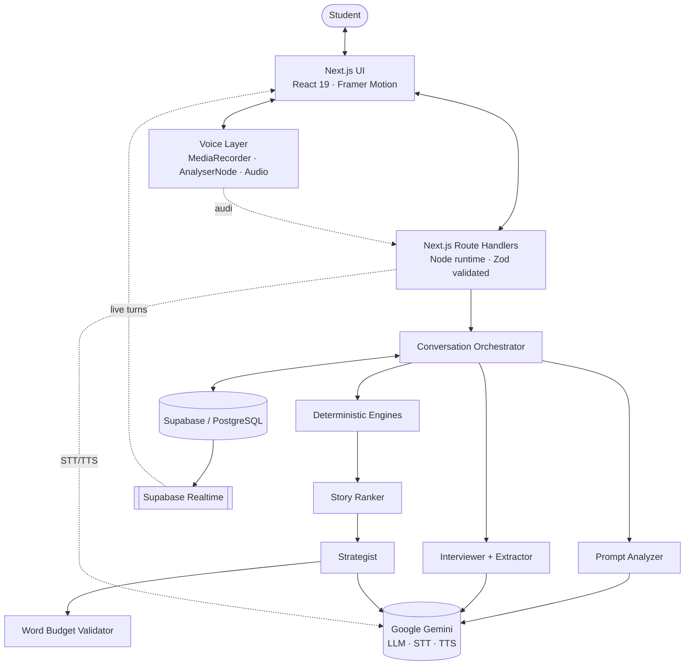
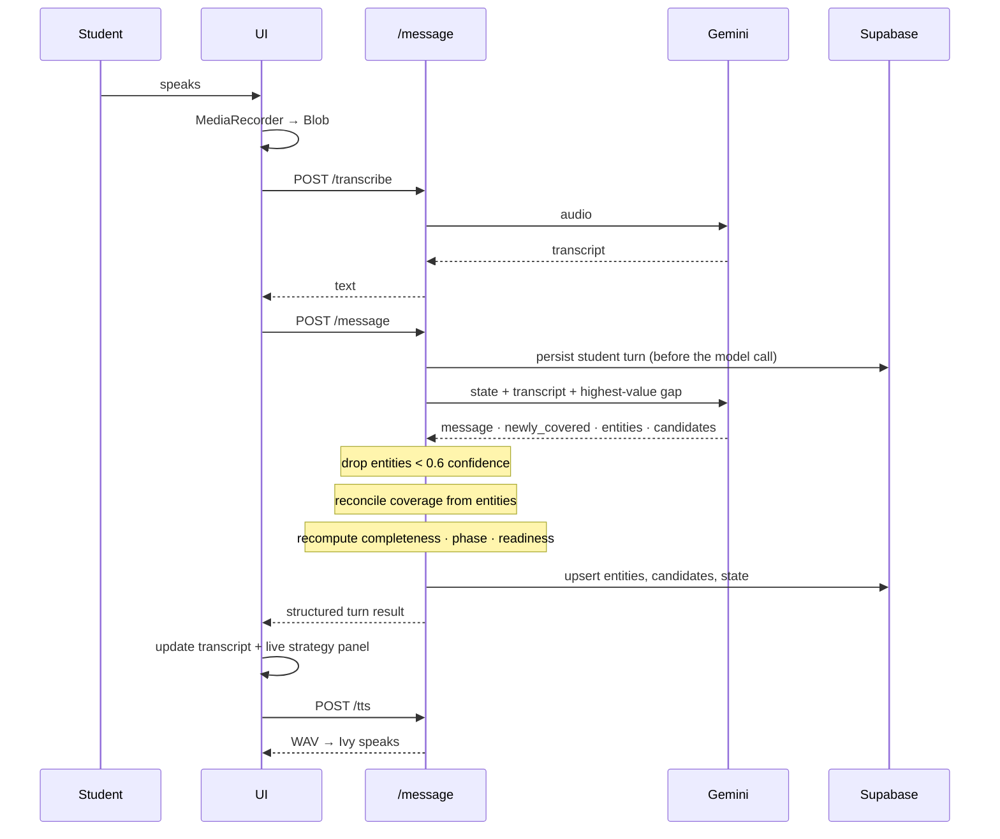
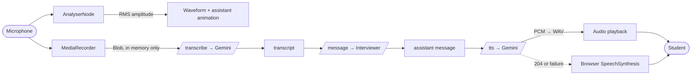
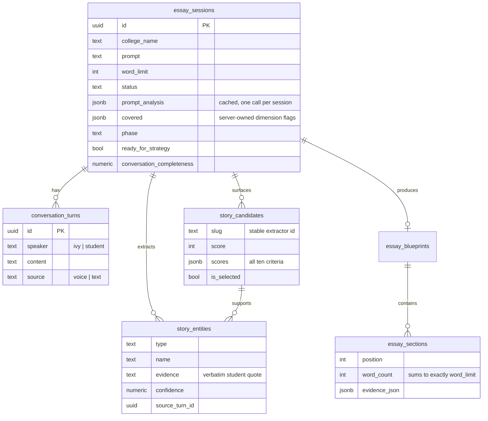

# Architecture

## System overview



## The central design decision

**The model reports observations. The server owns all derived state.**

An LLM is good at understanding language and unreliable at arithmetic, consistency, and honesty about its own confidence. So the interviewer is asked only for things it is good at — *what did the student just say, and what should I ask next* — and everything load-bearing is computed in TypeScript:

| Concern | Owner | Why |
|---|---|---|
| Next question | Model | Requires language understanding |
| Entity extraction | Model | Requires language understanding |
| Completeness % | **Server** | Must be monotonic and reproducible |
| Which dimensions are covered | **Server** | Reconciled from evidence, not self-report |
| Interview phase | **Server** | Derived from the first gap; cannot loop |
| Readiness to finish | **Server** | Gates a one-way transition |
| Story ranking | **Server** | Must be explainable and stable |
| Word allocation | **Server** | Must total exactly 350 |

### Coverage reconciliation

The interviewer returns `newly_covered` (which dimensions it believes are now established) *and* `entities` (what it extracted). These occasionally disagree — it will extract a well-evidenced skill while forgetting to flag the `skills` dimension, leaving the interview unable to finish.

A stored entity already carries a verbatim quote and a confidence score, which makes it the stronger signal. So `reconcileCoverage` infers coverage from entities and merges it with the model's flags:

```
value              → values
skill              → skills
perspective_shift  → reflection
future_goal        → future_goal
college_connection → college_connection
experience         → specific_experience
```

Flags are only ever set, never cleared, so completeness stays monotonic.

## The adaptive loop



The student's answer is persisted **before** the model call, so a model failure never loses what they said — they can retry and their words are still there.

## Voice pipeline



Voice states: `idle` → `requesting_permission` → `listening` → `processing` → `thinking` → `speaking`, plus `error`. Each has a distinct UI treatment. Starting the microphone cancels any in-flight speech, so the student can interrupt Ivy.

The waveform is driven by real RMS amplitude from an `AnalyserNode`, kept as a rolling history so it scrolls like a recorder rather than pulsing uniformly.

## Provider seams

```
lib/agents/provider.ts   LanguageModelProvider   generateStructured()
lib/agents/stt.ts        SpeechToTextProvider    transcribe()
lib/agents/tts.ts        TextToSpeechProvider    synthesize()
```

Nothing above these files knows which vendor is in use. Swapping Gemini for OpenAI, Groq or OpenRouter means editing three files; the agents, routes, and UI are untouched. Model ids are also environment-overridable (`IVY_FAST_MODEL`, `IVY_STRATEGY_MODEL`, `IVY_STT_MODEL`, `IVY_TTS_MODEL`), so a retired model can be re-pointed without a deploy.

`generateStructured` retries transient failures (rate limits, 503s, timeouts) twice with exponential backoff, but does **not** retry schema violations — retrying malformed output rarely helps and costs latency.

## Word budget algorithm

Largest-remainder apportionment. The model proposes a shape; the server makes it exact.

```
1. weights   = each section's proposed word_count (even weighting if all zero)
2. exact[i]  = weights[i] / Σweights × target
3. floored[i]= max(5, floor(exact[i]))          ← 5-word floor keeps sections meaningful
4. remainder = target − Σfloored
5. distribute remainder one word at a time, in descending order of
   fractional part, cycling until it reaches zero
6. assertBudget(sections, target)               ← throws if Σ ≠ target
```

This preserves the model's intended proportions (a 100-word section stays roughly twice a 50-word one) while landing exactly on the target. `assertBudget` runs inside the strategist *and* again in the route, so a wrong total cannot reach the client.

## Story scoring

Ten criteria, each 0–10, weighted into 0–100. All computed from transcript text — no model opinion involved, so the same conversation always produces the same ranking and "why A beat B" is a diff of criterion scores.

| Criterion | Weight | Signal |
|---|---|---|
| Specificity | 1.3 | Numbers, proper nouns, temporal markers |
| Authenticity | 1.2 | First-person concrete recall vs. abstract summary |
| Reflection depth | 1.3 | "realized", "used to", "instead", "taught me" |
| Personal growth | 1.2 | Reflection + impact depth |
| Emotional depth | 0.9 | Emotion entities + affect vocabulary |
| Prompt relevance | 1.3 | How many narrative parts are filled |
| Evidence strength | 1.1 | Mean entity confidence × breadth |
| Future connection | 1.0 | Depth of the forward-looking material |
| College connection | 0.8 | Explicit college entity |
| Distinctiveness | 0.9 | Penalises well-worn essay framings |

The resulting number is an **internal selection signal**, surfaced only as a rough strength meter — never presented as an admissions judgement.

## Error model

Every route funnels failures through `handleRouteError`, producing `{ error, code }`:

| Code | Status | UI treatment |
|---|---|---|
| `missing_api_key` | 503 | Setup banner with the exact env var and where to get a key |
| `model_failed` | 502 | "Ivy could not think that through" + retry |
| `invalid_input` | 400 | Specific validation message |
| `not_found` | 404 | Falls back to creating a fresh session |
| `database_unavailable` | 503 | "Your answer was not lost" + retry |
| `not_ready` | 409 | "Keep talking with Ivy a little longer" |
| `server_error` | 500 | Generic + retry |

The client maps each code to an icon and message. Nothing fails silently, and nothing shows a raw stack trace.

## Data model



Realtime is enabled on `conversation_turns`, `essay_sessions` and `story_entities`, so an open tab reflects changes made anywhere.
