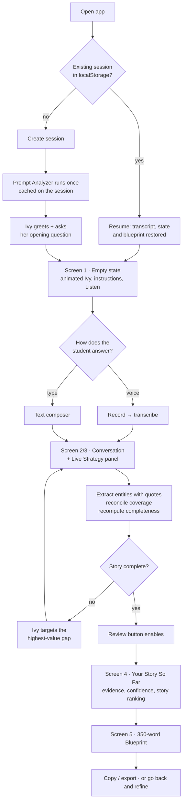

# Product flow

## The student's journey

## Screen by screen

### Screen 1 — Empty brainstorming session

The landing state. Header carries the Hello Ivy mark, *New Essay Brainstorming*, the college and essay title, a **350 words** pill, session timer and avatar.

Below it, the **Instructions** card with a working **Listen** button — it reads the instructions aloud through the real TTS pipeline and turns into a Stop control while speaking. *Read more* expands to show the actual essay prompt.

The conversation card shows the animated Ivy assistant, her greeting, and her opening question. The composer sits at the bottom: microphone as the primary control, typing always available, privacy note underneath.

> **Ivy:** "Hey! I'm Ivy. I'll help you discover the strongest story for this essay. We won't write the essay yet — first, I'd like to understand you."
>
> **Ivy:** "Think about an experience that changed the way you see yourself. What comes to mind?"

The opening question is generated by the Prompt Analyzer from the essay prompt, so a different prompt opens differently.

### Screens 2 & 3 — Information capture and live strategy

These are **states of one screen**, not separate routes. Once the student answers, the transcript replaces the empty state and the Live Strategy column appears alongside it. That is what "the structure develops while the conversation happens" requires — a route change would break it.

The card header shows *N / 9 areas explored* and the session timer. The transcript runs vertically: Ivy's turns carry the assistant mark and a replay button, the student's carry an avatar.

The right column fills in as evidence arrives:

- **Potential core story** — the experience Ivy is tracking
- **Current theme** — the perspective shift, if one has emerged
- **Values / Skills identified** — chips, each showing confidence, each hovering to reveal the student's own quote
- **Perspective shift** — the verbatim quote
- **Still missing** — which dimensions remain

Empty sections read *"Still exploring…"* rather than sitting blank.

**Review & Edit Structure** stays disabled until the server says the story is complete. The tooltip explains why.

### Screen 4 — Your Story So Far

Structured review of everything extracted. Each row shows the content, a confidence percentage, and the transcript quote behind it. The student can confirm or remove any item; nothing blocks progress, because the assignment requires the workflow to run without human intervention.

When more than one experience surfaced, this screen also shows the ranking with scores and a plain-language explanation of why the winner is stronger.

### Screen 5 — Your 350-Word Essay Blueprint

Core story, central message, why this story works, and a story-strength dial (labelled explicitly as an internal signal, not an admissions score).

Then the sections. Each carries its allocated word count, purpose, what to include, **the student's own words to draw on**, the questions that section must answer, a suggested narrative approach, and a transition.

The word total is displayed prominently with a **Verified exact** badge — the number is asserted server-side, not claimed by the model.

Export as text or JSON; go back to refine.

## The adaptive loop in practice

The difference between a questionnaire and an interview, from a real run:

| Turn | Student said | Ivy asked | Why |
|---|---|---|---|
| 1 | Noticed staff struggling with paper records | *"What specific action did you take when you saw the staff struggling?"* | Experience + challenge covered; **action** missing |
| 2 | Explained *why* she helped (watching Ms. Reyes lose 3 hours) | *"What did you actually do next to help Ms. Reyes?"* | Motivation given, but still no **action** — Ivy holds the same gap rather than moving on |
| 3 | Built a web app, rewrote it once for usability | *"Once the app was up and running, what changed for Ms. Reyes and the center?"* | Action covered; **impact** missing |
| 4 | Ms. Reyes got an afternoon back; realized tech solves human problems | *"How did that realization change how you view your future goals?"* | Impact + reflection landed together; jumps to **future goal** |
| 7 | Named Bryn Mawr's Praxis program | *"What specific technical skills did you draw on?"* | College connection covered; **skills** was the last gap |

Note turn 2: a static questionnaire would have advanced. Ivy noticed the answer explained *motivation* rather than *action* and re-asked, more concretely.

## What ends the interview

Not a question count. The server requires:

- the narrative spine — experience, challenge, action, impact, reflection
- **and** future goal and college connection (the prompt asks for both)
- **and** at least one value at ≥ 0.6 confidence
- **and** at least one skill or perspective shift at ≥ 0.6 confidence

Or the student says they want to stop, which the interviewer reports as `student_requested_finish`.

## Failure paths

Every one has a designed state, not a crash:

| What happens | What the student sees |
|---|---|
| Microphone permission denied | *"Microphone access is blocked. You can enable it in your browser settings or continue by typing."* |
| No speech in the recording | *"We couldn't hear that clearly. Try again or type your response."* |
| Model call fails | Answer is restored to the composer with a retry button — it was persisted before the call, so nothing is lost |
| No API key configured | Setup banner naming the exact env var and where to get a free key |
| TTS unavailable | Silently falls back to the browser's speech synthesis; Ivy still talks |
| Database unreachable | *"We could not reach your session storage. Your answer was not lost — try again."* |
| Blueprint requested too early | *"There is not enough of your story yet. Keep talking with Ivy a little longer."* |
| Tab closed mid-session | Reopening restores the transcript, state and blueprint |

## Loading states

Contextual, never a bare spinner:

- *Listening…* with a live waveform and elapsed timer
- *Transcribing…*
- *Understanding your story…*
- *Finding the strongest follow-up…*
- *Building your 350-word blueprint…*
